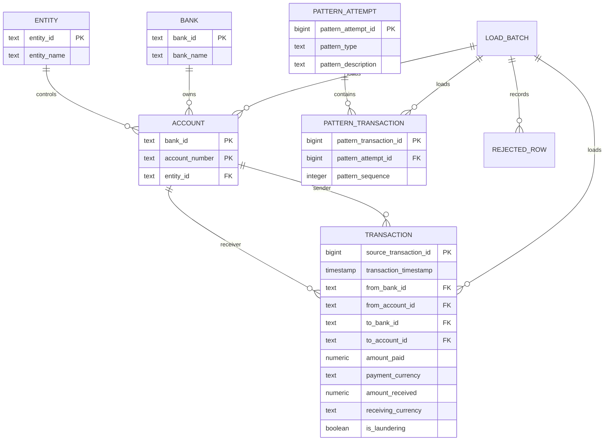

# Source ERD

```mermaid
erDiagram
    LOAD_BATCH ||--o{ ACCOUNT : loads
    LOAD_BATCH ||--o{ TRANSACTION : loads
    LOAD_BATCH ||--o{ PATTERN_TRANSACTION : loads
    LOAD_BATCH ||--o{ REJECTED_ROW : records

    BANK ||--o{ ACCOUNT : owns
    ENTITY ||--o{ ACCOUNT : controls
    ACCOUNT ||--o{ TRANSACTION : sender
    ACCOUNT ||--o{ TRANSACTION : receiver
    PATTERN_ATTEMPT ||--o{ PATTERN_TRANSACTION : contains

    BANK {
        text bank_id PK
        text bank_name
    }
    ENTITY {
        text entity_id PK
        text entity_name
    }
    ACCOUNT {
        text bank_id PK
        text account_number PK
        text entity_id FK
    }
    TRANSACTION {
        bigint source_transaction_id PK
        timestamp transaction_timestamp
        text from_bank_id FK
        text from_account_id FK
        text to_bank_id FK
        text to_account_id FK
        numeric amount_paid
        text payment_currency
        numeric amount_received
        text receiving_currency
        boolean is_laundering
    }
    PATTERN_ATTEMPT {
        bigint pattern_attempt_id PK
        text pattern_type
        text pattern_description
    }
    PATTERN_TRANSACTION {
        bigint pattern_transaction_id PK
        bigint pattern_attempt_id FK
        integer pattern_sequence
    }
```

quan hệ account–transaction được kiểm tra logic 
bằng khóa `(normalized bank_id, account_number)`
