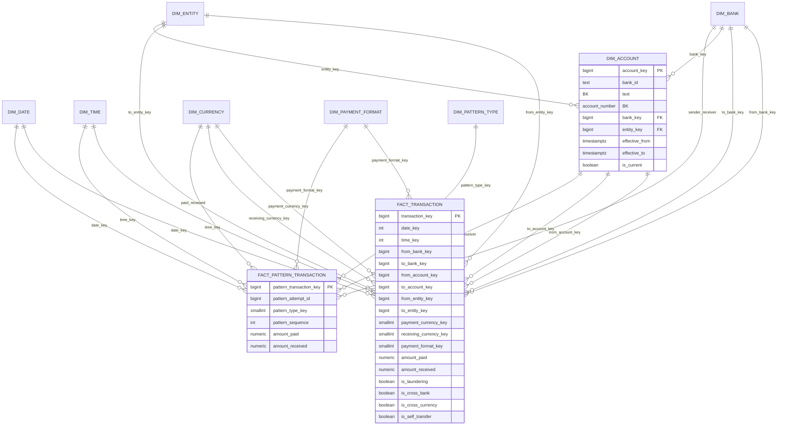

# Data Warehouse ERD – IBM AML HI-Medium

## Ghi chú

- Các quan hệ sender/receiver là role-playing dimension.
- Fact transaction giữ grain nguyên tử, không aggregate trước khi nạp.
- Quan hệ logical của fact lớn được kiểm tra bằng ETL validation thay vì FK vật lý trên từng dòng.
- `dim_account` là SCD Type 2; fact lookup version đang hiệu lực trong dataset hiện tại.

